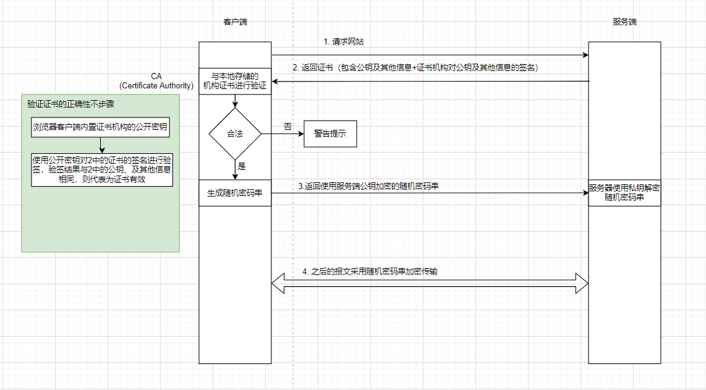
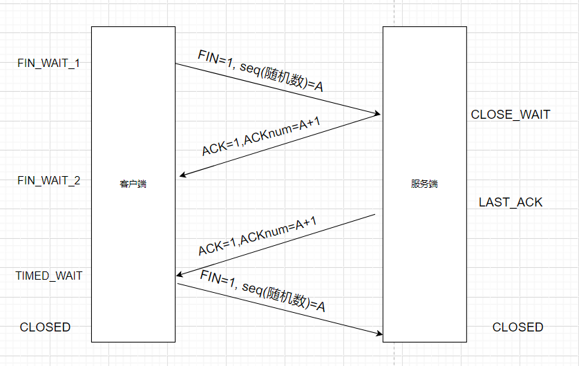

# Summay

## JAVA基础

### 枚举enum

是什么：变量的取值都在有限的集合内。

作用场景：如四季，星期，尺码，数据库status；还可以用于单例模式。

方法

- static Enum valueOf(Class enumClass, String name)：返回指定枚举常量
- String toString()：返回枚举常量名
- int ordinal()：返回枚举下标，类似数组
- T values()：返回所有枚举变量
- int compareTo(E other)：return this.ordinal() - other.ordinal();

使用枚举诞生之前，一般使用常量类。

**常量类**

```JAVA
public class SeasonConstant {
	public static final int SPRING = 1;
	public static final int SUMMER = 2;
	public static final int AUTUMN = 3;
	public static final int WINTER = 4;
}
```

枚举类

```java
public enum SeasonEnum {
  SPRING,
  SUMMER,
  AUTUMN,
  WINTER;
}
```

看需求，体会枚举类的优点。

**需求1**：根据季节输出月份

常量类版函数

```java
// 根据季节输出月份
public static void printMonth(int season) {
  switch(season) {
    case 1:
      System.out.println("1-3月份");
      break;
    case 2:
      System.out.println("4-6月份");
      break;
    case 3:
      System.out.println("7-9月份");
      break;
    case 4:
      System.out.println("10-12月份");
      break;
    default:
      System.out.println("输入的季节有误！");
  }
}
```

枚举类版函数

```java
// 根据季节输出月份
public static void printMonth(SeasonEnum season) {
  switch(season) {
    case SPRING:
      System.out.println("1-3月份");
      break;
    case SUMMER:
      System.out.println("4-6月份");
      break;
    case AUTUMN:
      System.out.println("7-9月份");
      break;
    case WINTER:
      System.out.println("10-12月份");
      break;
  }
}
```

测试函数

```java
public class EnumerateTest {
    public static void main(String[] args) {
        SeasonConstant.printMonth(SeasonConstant.SPRING);
        SeasonEnum.printMonth(SeasonEnum.AUTUMN);
    }
}
```

存在问题：testSeasonConstant(5)可以不走常量类，直接运行，且不存在此季节。

优点:

- 可以限定函数的输入范围

**需求2**：根据季节输出中文名

常量类版函数

```JAVA
// 输出中文名
public static void printChineseName(int season) {
  switch(season) {
    case 1:
      System.out.println("春天");
      break;
    case 2:
      System.out.println("夏天");
      break;
    case 3:
      System.out.println("秋天");
      break;
    case 4:
      System.out.println("冬天");
      break;
    default:
      System.out.println("输入的季节有误！");
  }
}
```

枚举类版

```java
public enum SeasonEnum {
  SPRING("春天"),
  SUMMER("夏天"),
  AUTUMN("秋天"),
  WINTER("冬天");

  private String chineseName;

  SeasonEnum(String chineseName) {
    this.chineseName = chineseName;
  }

  public String getChineseName() {
    return chineseName;
  }

  // 根据季节输出中文名
  public static void printChineseName(SeasonEnum season) {
    System.out.println(season.getChineseName());
  }
}
```

枚举类优点：

- 可以附多个属性，无需再switch判断


枚举单例

### ConcurrentHashMap

```java
//false 代表非Set集合
public V put(K key, V value) {
    return putVal(key, value, false);
}

// 1.不支持key、value为null
// 2.循环table，即自旋
// 3.判断table为nul或length==0,初始化
// 4.(n=tab.lenght)&(n-1)即下标处无元素，直接使用CAS添加node
// 5.下标处元素hash==-1，转移元素（头结点是特殊节点）
// 6.synchronized(头节点)，key相同返回原始值。不相同，返回null,大于等于8树化，增加计数。

final V putVal(K key, V value, boolean onlyIfAbsent) {
    if (key == null || value == null) throw new NullPointerException(); // 不支持null的key or value
    int hash = spread(key.hashCode()); // hash散列：(h ^ (h >>> 16)) & HASH_BITS;16高位散列与低16异或
    int binCount = 0;
    for (Node<K,V>[] tab = table;;) {
        Node<K,V> f; int n, i, fh; // n:tab.length,i:(n-1)&hash
        if (tab == null || (n = tab.length) == 0)
            tab = initTable(); // 通过native.CAS实现安全初始化
        else if ((f = tabAt(tab, i = (n - 1) & hash)) == null) {
            if (casTabAt(tab, i, null,
                         new Node<K,V>(hash, key, value, null))) // CAS
                break;                   // no lock when adding to empty bin
        }
        else if ((fh = f.hash) == MOVED)
            tab = helpTransfer(tab, f);
        else {
            V oldVal = null;
            synchronized (f) {
                if (tabAt(tab, i) == f) {
                    if (fh >= 0) {
                        binCount = 1;
                        for (Node<K,V> e = f;; ++binCount) {
                            K ek;
                            if (e.hash == hash &&
                                ((ek = e.key) == key ||
                                 (ek != null && key.equals(ek)))) {
                                oldVal = e.val;
                                if (!onlyIfAbsent)
                                    e.val = value;
                                break;
                            }
                            Node<K,V> pred = e;
                            if ((e = e.next) == null) {
                                pred.next = new Node<K,V>(hash, key,
                                                          value, null);
                                break;
                            }
                        }
                    }
                    else if (f instanceof TreeBin) {
                        Node<K,V> p;
                        binCount = 2;
                        if ((p = ((TreeBin<K,V>)f).putTreeVal(hash, key,
                                                              value)) != null) {
                            oldVal = p.val;
                            if (!onlyIfAbsent)
                                p.val = value;
                        }
                    }
                }
            }
            if (binCount != 0) {
                if (binCount >= TREEIFY_THRESHOLD)
                    treeifyBin(tab, i);
                if (oldVal != null)
                    return oldVal;
                break;
            }
        }
    }
    addCount(1L, binCount);
    return null;
}
```

## 设计模式

### 单例模式


## 网络

### HTTP

- 传输层TCP/IP协议之上的应用层协议，默认端口80
- 不保存状态
- 以ASCLL码传输

#### HTTP 报文

**请求报文**

```BASH
<method> <request-url> <version> # 状态行
<headers> # 请求头
<entity-body> # 消息主体
```

**method**: 对url资源的操作

- get
- post
- put
- delete

**request-url**：一个URL描述网络上的一个资源

**version**：http协议的版本

**headers**

- host
- User-Agent
- Connection
- Content-Type
- Content-Length
- ...

```BASH
 POST / HTTP/1.1
 Host: www.example.com
 User-Agent: Mozilla/5.0 (Windows; U; Windows NT 5.1; en-US; rv:1.7.6)
 Gecko/20050225 Firefox/1.0.1
 Content-Type: application/x-www-form-urlencoded
 Content-Length: 40
 Connection: Keep-Alive

 sex=man&name=Professional 
```

**相应报文**

```bash
HTTP/1.1 200 OK # 状态行

Server:Apache Tomcat/5.0.12 # 响应头
Date:Mon,6Oct2003 13:23:42 GMT
Content-Length:112

<html>... # 响应正文
```

状态码

- `200 OK` 客户端请求成功
- `301 Moved Permanently` 请求永久重定向
- `302 Moved Temporarily` 请求临时重定向
- `304 Not Modified` 文件未修改，可以直接使用缓存的文件。
- `400 Bad Request` 由于客户端请求有语法错误，不能被服务器所理解。
- `401 Unauthorized` 请求未经授权。这个状态代码必须和WWW-Authenticate报头域一起使用
- `403 Forbidden` 服务器收到请求，但是拒绝提供服务。服务器通常会在响应正文中给出不提供服务的原因
- `404 Not Found` 请求的资源不存在，例如，输入了错误的URL
- `500 Internal Server Error` 服务器发生不可预期的错误，导致无法完成客户端的请求。
- `503 Service Unavailable` 服务器当前不能够处理客户端的请求，在一段时间之后，服务器可能会恢复正常。


### HTTPS




### TCP

transmission control protocol ：传输控制协议

- 面向连接的，可靠的，基于字节流传输的通信层协议。

应用层（http等）向TCP发送8位字节表示的数据流，TCP将数据流分割成适当长度的报文段（受MTU限制），传给IP层，由它传给接收端的TCP层。

服务端执行listen函数后，存在两个队列

- SYN：第二次握手
- ACCEPT：第三次握手

#### 三次握手


#### TCB

transmission control block: 保存了连接信息一条条session

#### session

- 源端口，目的端口，目的IP，序列（随机数），应答序号，双方窗口大小，tcp状态，tcp输入输出队列，应用层输出队列，tcp重传有关变量。

#### 可靠性、强壮性保证措施

- 序号机制：发送端每一个字节传输序号+1，(0 - 2^32-1)
- 确认机制：接收端每一个字节传输序号+1，接收到一定数量的连续字节流才发送ACK（选择确认）
- 校验机制：头部和数据部分的和计算出来，再对其求反码 + 有源地址、目的地址、协议以及TCP        的长度
- 重传机制
  - 超时重传 ：发送端默认时间间隔内没有收到ACK包，重传
  - 重复累计确认：接收端重复确认最后一个收到的包N, 即N+1包丢失
- 计时器：控制超时重传间隔时间
- 流控制：接收端控制，防止发送端短时间大数据

#### 四次挥手




## 框架

### Spring

#### 什么是spring

spring是一个轻量级开发框架，致力于提高开发效率和系统可维护性。

#### spring核心模块

​	

- CORE：核心，主要提供IOC依赖注入功能。
- AOP：面向切面编程的实现
- JDBC：java数据库连接
- WEB：为创建WEB程序提供支持
- TEST：提供了Junit测试的支持
- ORM：提供支持hibernate等ORM工具

总结：主要模块

#### 核心思想

**IOC**

- 资源不由使用资源的双方管理，由不使用资源的第三方管理

  好处

  - 集中管理，带来易管理
  - 降低耦合度

两种方法实现

- XML
- 配置类

**bean的作用域**

- 默认单例且饿汉
- 更改为prototype则为多例懒汉
- request
- session

**IOC容器添加组件的方式**

- @CompentScan、@Controller、@Service、@Repository、@component
- 


### SpringBoot

#### 自动装配原理

文章：https://www.cnblogs.com/javaguide/p/springboot-auto-config.html

是什么：通过注解或者简单的配置就能在springboot的帮助下实现某个功能

核心注解

- SpringbootApplication

  - SpringBootConfiguration：是一个配置类

    - Configuration

  - ComponentScan：扫描启动类包下所有被Component(Controller,Server)修饰的bean

  - EnableAutoConfiguration：开启自动装配

    

```JAVA
@Target({ElementType.TYPE})
@Retention(RetentionPolicy.RUNTIME)
@Documented
@Inherited
<1.>@SpringBootConfiguration
<2.>@ComponentScan
<3.>@EnableAutoConfiguration
public @interface SpringBootApplication {

}

@Target({ElementType.TYPE})
@Retention(RetentionPolicy.RUNTIME)
@Documented
@Configuration //实际上它也是一个配置类
public @interface SpringBootConfiguration {
}
```

**@EnableAutoConfiguration:实现自动装配的核心注解**

```JAVA
@Target({ElementType.TYPE})
@Retention(RetentionPolicy.RUNTIME)
@Documented
@Inherited
@AutoConfigurationPackage //作用：将main包下的所欲组件注册到容器中
@Import({AutoConfigurationImportSelector.class}) //加载自动装配类 xxxAutoconfiguration
public @interface EnableAutoConfiguration {
    String ENABLED_OVERRIDE_PROPERTY = "spring.boot.enableautoconfiguration";

    Class<?>[] exclude() default {};

    String[] excludeName() default {};
}
```

这只是简单的注解，核心是导入了一个`AutoConfigurationImportSelector`自动装配类。

**AutoConfigurationImportSelector:加载自动装配类**

继承体系

```JAVA
public class AutoConfigurationImportSelector implements DeferredImportSelector, BeanClassLoaderAware, ResourceLoaderAware, BeanFactoryAware, EnvironmentAware, Ordered {

}

public interface DeferredImportSelector extends ImportSelector {

}

public interface ImportSelector {
    String[] selectImports(AnnotationMetadata var1);
}
```

核心是`ImportSelector`的接口`selectImport`接口


总结：

由`SpringBootApplication`注解引入`EnableAutoConfiguration`注解再引入`AutoConfigurationImportSelector`注解实现了`ImportSelector`接口，将所有meta-inf/spring.factories下所有满足condition注解条件的自动配置类注入IOC容器中。所有可配置属性都可在EnableConfigurationProperties指定的配置类中找到，属性是通过set自动注入的。


**那为什么实现了ImportSelector就可以加载类呢？**

答：在spring源码中，留有很多暗门，只要实现了某些接口就可以被扫描到，注入IOC容器中。

**有哪些接口呢？**

beanFactoryPostPostProcessor

beanDefinitionRegestryPostProcessor

beanPostProcessor

aware

核心就是一些接口，只要实现了这些接口，就会执行接口方法


1. 扫描spring-boot-autoconfig jar包下meta-inf/spring.factories，中的自动装配类，自动装配类通过EnableConfigurationProperties指定配置类，里面包含所有可以配置的属性，配置文件中的属性是调用set实现自动注入。


springboot启动时会扫描外部引用jar包的MATE-INF/spring.factories

### Redis

### 消息队列

优点

- 异步提速
- 削峰填谷
- 应用解耦

缺点

- 增加系统复杂度
- 系统可用性降低
- 消息一致性问题

选型


- RabbitMQ：erlang开发，低延时，但消息堆压时性能会急剧下降
- RocketMQ：java开发，功能最完备，支持的并发量最高，面向互联网集群化。
- Kafks：scale开发，面向日志，性能最高，但容易丢数据，但每秒钟消息数量不多时，延时反而较高。
- ActiveMQ：java开发，老牌，性能较低，不推荐使用

### RocketMQ

四大模块

- Nameserver：提供轻量级的Brocker路由服务。注册中心，与Zookeeper的区别是【无状态】
- Producter：生产者，负责发送消息到Broker
- Broker：MQ本身，负责收发消息，持久化消息
- Consumer：消费者，消费消息

消息类型

- 基本样例
- 顺序消费
- 广播消息：消费组成员
- 延迟消息：延迟一定等级时间后再发送出去
- 批量消息
- 过滤消息


## Git

### 操作

#### 本地已有仓库，远程未存在

```bash
git init # 本地初始化
git remote add origin <远程仓库> # 先远程创建同名仓库
git pull # 拉去远程仓库，且合并
git add . # 本地文件加入tracking
git commit -m "message" # 提交到本地仓库
git push # 推送远程仓库
```

### error

#### OpenSSL SSL_read: Connection was aborted, errno 10053

原因，远程仓库修改了密码。`git config http.sslVerify "false"` 清除本地ssl验证，之后重新输入密码


